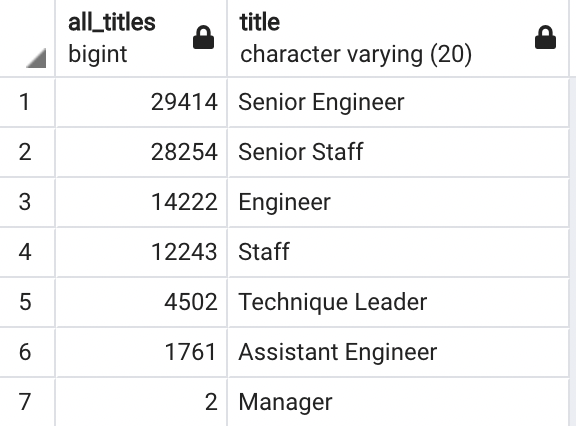
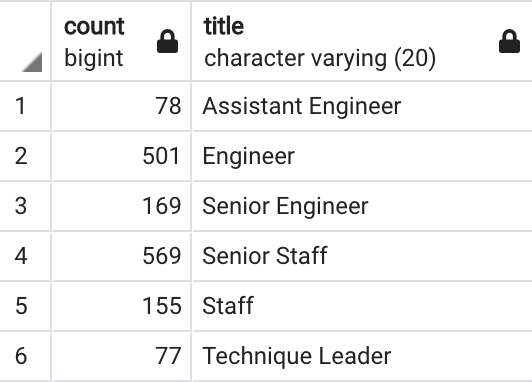

# Pewlett Hackard Analysis

## Project Purpose 
To prepare for a wave of upcoming retirements at a large company, an analysis was conducted to determine the number of eligible retirees by title as well as the number of employees eligible for a mentorship program based on their experience level to train new hires. Eligible retirees were defined as current employeees born between the years 1925-1955. Employees eligible for the mentorship program were defined as current employees born in the year 1965.

## Results 
### Eligible Retirees by Title
- Data from multiple tables were merged to geenrate a table of eligible retirees with their employee number, name, birth date and title included
- This table was then used to count the number of employees by title and group by title
- This data query determined that 90,398 employees were reaching retirement.
- Of those eligible employees, a majority (63%) are senior employees in the roles of Senior Engineers and Senior Staff. 
- Only 2 Managers are eligible for retirement.



### Employees Eligible for the Mentorship Program
- A query was then executed to find the names of current employees along with their title who were born in the year 1965, which signifies mentorship program eligibility.
- Once this table was generated, it was used to determine the number of eligible employees which totaled 1,549.

## Summary
### The Silver Tsunami
- This analysis revealed the vast number of roles that will need to be filled as eligible employees start to retire. The 90,398 number is staggering and that number of future open positions means the company needs to start planning now to strategize on how to fill those positions and train new hires.
- A majority of retiring employees are in senior roles, so the company can consider filling some of those roles by promoting from within to allow for some of the open positions to be transferred to less-senior positions which may be easier to roles fill and subsequently train those new hires.

### Mentoring the New Wave
- The mentorship program is a great opportunity to establish a process for training new hires, and the initial query determined that 1,549 employees would be eligible to participate. To help organize the mentorship program, it would be a good idea to understand how many employees per role would be eligible to mentor. This query on the mentorship eligiblity table allows us to determine that breakdown:

``` 
SELECT COUNT(me.title), title from mentorship_eligibility as me
GROUP BY me.title
ORDER BY me.title;
```

The output of this query is as follows:



- This shows that a majority of eligible mentorship employees are in the roles of Senior Engineer and Senior Staff, which is where the majority of open positions will be focused. However, the ratio of eligible Senior Engineer mentors to open positions is 1:74 and 1:50 for Senior Staff. 
- The overall ratio of eligible mentorees to open positions would be 1:58. 
- The discrepancy between mentorees and retirees suggests that the mentorship program will not be robust enough as currently designed to support the number of upcoming open positions.

### Conclusion
Based on this analysis, the recommendation would be to increase the size of the mentorship program to include a larger number of current employees and not limit it to those born in 1965. After all, age does not necessarily dictate level of job experience or mentorship abilities. Additionally, by promoting from within, the company could prevent the extent of mentoring required for certian positions, as those employees may already have a solid foundation in the role.

To better plan for the number of expected upcoming roles, the company should also consider determing the expected number of retirements by month over the course of the next couple years. Since all of the eligible employees will likely not retire at the same time, this means the number of open positions at a given time will be less than the total, and will improve the ratio of eligible mentors for number of open positions.
